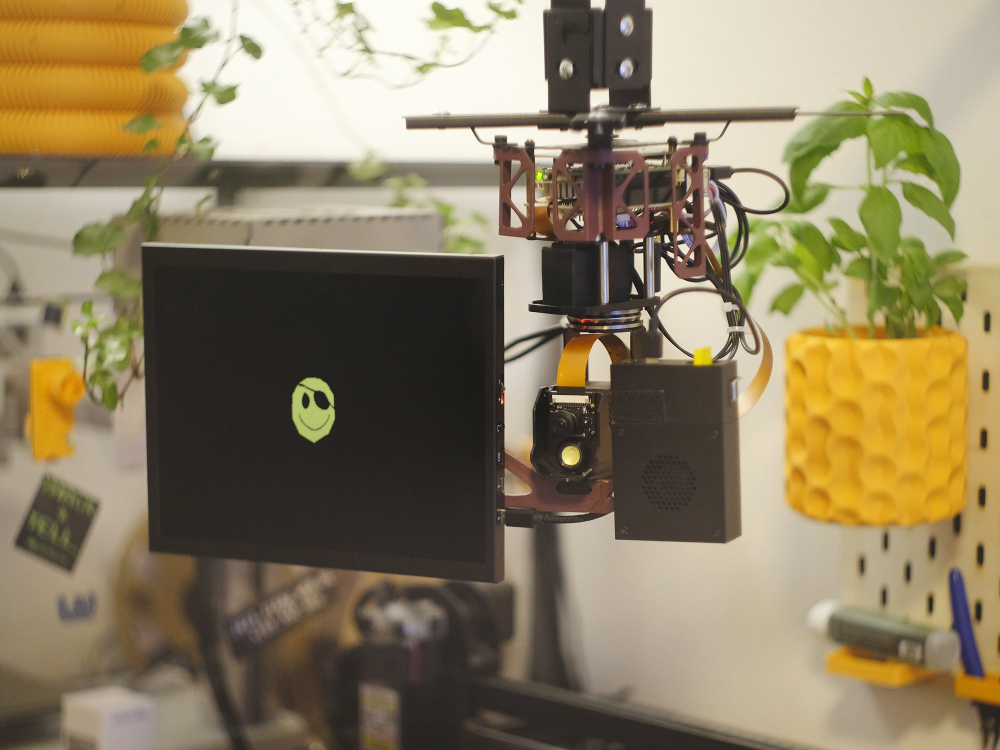
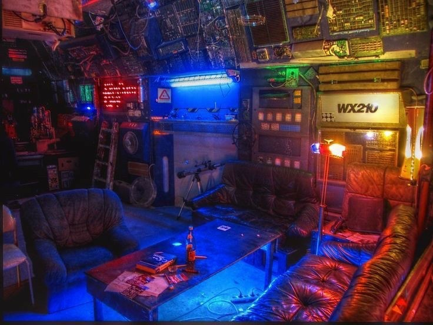
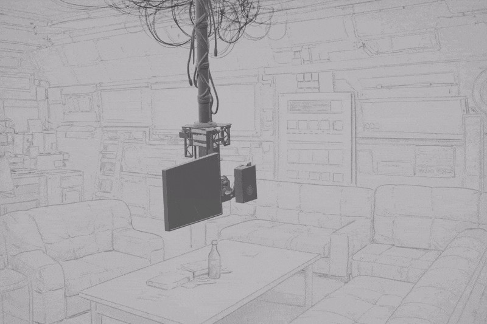
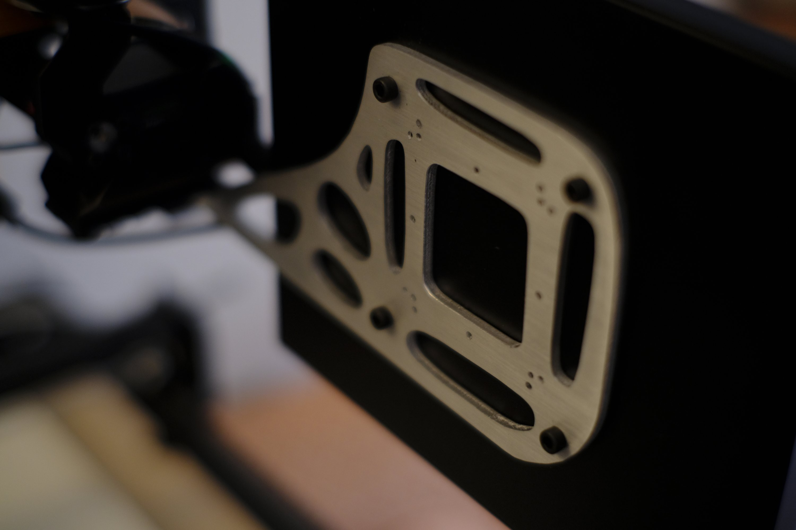
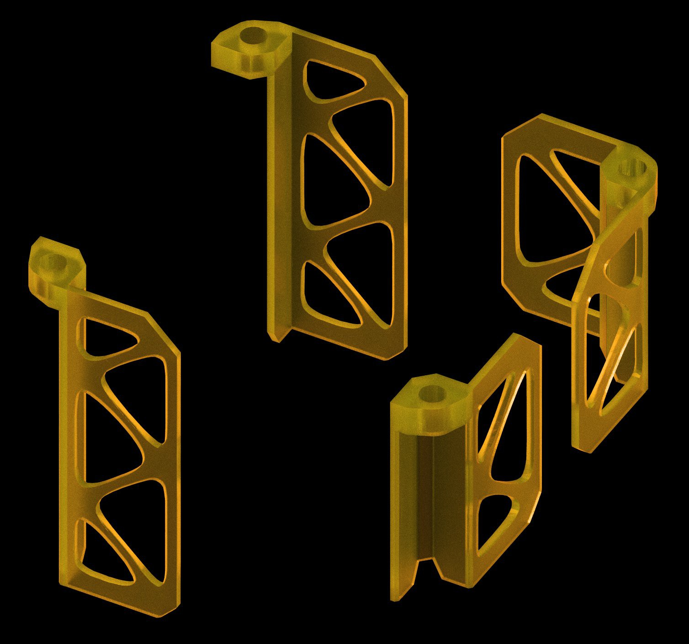
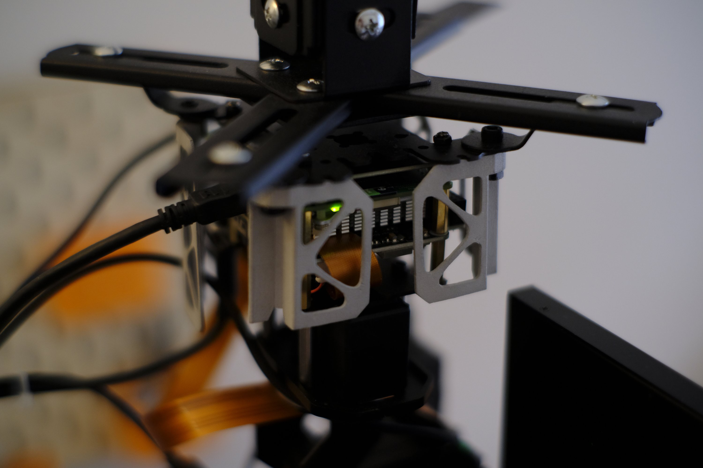

# Tracking Screen

A screen that follows you around the room. It can be used as a personal assistant, to display data, or simply to watch movies without needing to constantly adjust the angle — it self-calibrates to keep the view optimal.

**Made possible thanks to [PCBWay](https://www.pcbway.com/) for their support in making this project a reality.**



## Background

I first had this idea after catching a cold while visiting my old hackerspace in Berlin, [c-base](https://c-base.org/), and having to spend a few days in bed. I thought it would be cool to have a robotic screen that can track faces, and that you can reposition using hand commands. I could also see this as a kind of digital assistant, although I personally don't see the use case for myself yet.



## Demo



Hand commands moving the screen to each side. Facial tracking also works in decent enough light — the camera can be upgraded for better range and low-light performance.

## Features

- **Face Detection & Tracking**: Real-time face detection using MediaPipe
- **Gesture Recognition**: Hand gesture detection (palm for left, shaka for right)
- **Smooth Servo Control**: Pan-tilt camera movement with smooth tracking
- **Background Tracking**: Continues scanning when no face is detected
- **Multiple Detection Methods**: Uses both MediaPipe and OpenCV for robust tracking
- **Customizable Configuration**: YAML-based configuration system

## Hardware

### Base Platform

This build is based on the **Waveshare 360° Omnidirectional High-Torque 2-Axis Expandable Pan-Tilt Camera Module**. The module is turned upside down and mounted to a projector holder.

### Components

- Raspberry Pi (4/5 recommended)
- Waveshare 360° Pan-Tilt Camera Module
- [9.7" portable monitor](https://aliexpress.com/item/1005007196893258.html) (or similar — preferably one with VESA mounts)
- IKEA FREKVENS speaker (Teenage Engineering) for audio
- Projector mount or any stable VESA-compatible mount
- Angled HDMI cable (mini male to micro female)

### Mounting Bracket



The SVG for laser-cutting the mounting plate from [4mm aluminum sheet](https://www.pcbway.com/rapid-prototyping/Sheet-metal/Laser-Cutting.html) is included in the `media/` folder. This is surprisingly affordable (under $30 at the time of writing) and significantly more stable than 3D-printed PETG-CF.

The bracket uses a simple topology-optimized design that gives the build an organic Y2K aesthetic. The 3D-printed version can be printed in two parts on a Bambu A1 Mini and superglued together — not perfect, but it holds up well enough if you don't have a large enough build plate.

### Tower Covers



Optional secondary parts for the tower are included. Originally planned as a full enclosure, but the moving parts required a simplified design. These look great when printed in [UTR Thermal resin](https://www.pcbway.com/rapid-prototyping/3d-printing/plastic/resin/UTR-Therm-1-Resin/) or [SLS aluminum](https://www.pcbway.com/rapid-prototyping/3D-Printing/3D-Printing-SLS.html).



### Cabling

Use an **angled HDMI** cable (mini male to micro female), since the screen connection needs extra clearance to fit next to the camera. If you can't find that exact cable, use an adapter on the Raspberry Pi side instead.

## Downloadable Files

| File | Description |
|------|-------------|
| [`Tracking_Screen_LaserCut_4mm_Aluminium.svg`](media/Tracking_Screen_LaserCut_4mm_Aluminium.svg) | Full backing plate — laser cut from 4mm aluminum |
| [`Tracking_Screen_Backing_Screen.stl`](media/Tracking_Screen_Backing_Screen.stl) | 3D-printable screen backing part |
| [`Tracking_Screen_Backing_Speaker.stl`](media/Tracking_Screen_Backing_Speaker.stl) | 3D-printable speaker backing part |
| [`Tracking_Screen_Covers.stl`](media/Tracking_Screen_Covers.stl) | Cover parts for the tower |

## Software Stack

- **Computer Vision**: OpenCV, MediaPipe
- **Camera**: Picamera2, libcamera
- **Hardware Control**: Custom serial communication with ESP32-based controller
- **Processing**: Multi-threaded CV processing for real-time performance

## Installation

```bash
git clone https://github.com/Quackieduckie/tracking-screen.git
cd tracking-screen
pip3 install -r requirements.txt
nano config.yaml
```

## Configuration

Edit `config.yaml` to customize:

- Camera resolution and FPS
- Servo limits and speeds
- Detection thresholds
- Gesture recognition settings
- Tracking behavior

## Usage

### Basic Face Tracking

```python
from cv_ctrl import OpencvFuncs
from base_ctrl import BaseController

base = BaseController('/dev/ttyAMA0', 115200)
cv = OpencvFuncs('/path/to/project', base)

cv.face_detect_switch(True)
cv.base_ctrl.gimbal_base_ctrl(0, 0)
```

### Gesture Recognition

The system recognizes the following gestures:
- **Palm**: Open hand — move left
- **Shaka**: Hang loose gesture — move right

### Key Functions

**Face Tracking (`cv_ctrl.py`)**:
- `face_detect_switch(True/False)` — Enable/disable face detection
- `tracking_face_on_switch(True/False)` — Enable/disable camera movement
- `gimbal_base_ctrl(x, y)` — Manual camera positioning

**Hardware Control (`base_ctrl.py`)**:
- `gimbal_ctrl(direction, speed)` — Control servos
- `base_json_ctrl(command)` — Send JSON commands to base
- `pwm_servo_ctrl(id, angle)` — Direct servo control

## Technical Details

### Face Detection Pipeline

1. **Initial Detection**: MediaPipe FaceMesh for fast, accurate face detection
2. **Tracking**: Calculates face center and size
3. **Servo Control**: Smooth movement using PID-like control
4. **Background Scanning**: Pan movement when no face detected
5. **Re-acquisition**: Automatic face search behavior

### Performance Optimizations

- Multi-threaded processing
- Efficient frame buffering
- Adaptive FPS adjustment
- Hardware-accelerated encoding (H.264)
- Smart servo movement limits

### Coordinate System

- **X-axis**: Pan (left-right), range: -45° to +45°
- **Y-axis**: Tilt (up-down), range: -30° to +30°
- Center position: (0, 0)

## Project Structure

```
tracking-screen/
├── cv_ctrl.py           # Computer vision and tracking logic
├── base_ctrl.py         # Hardware controller interface
├── config.yaml          # Configuration settings
├── requirements.txt     # Python dependencies
├── models/              # MediaPipe and OpenCV models
├── media/               # Photos, GIF, STL/SVG files
└── README.md
```

## Dependencies

- Python 3.11+
- OpenCV (cv2)
- MediaPipe
- NumPy
- imutils
- Picamera2
- PyYAML
- pyserial

## Links

- **Hackaday project page**: [hackaday.io/project/204828-tracking-screen](https://hackaday.io/project/204828-tracking-screen)
- **More projects**: [enjoythed.biz](https://enjoythed.biz/)

## License

Based on Waveshare UGV example code. See LICENSE file for details.

## Credits

- Original UGV platform: Waveshare
- Custom modifications and enhancements: [@Quackieduckie](https://github.com/Quackieduckie)
- Sponsored hardware (sheet metal backing, SLS aluminum covers): [PCBWay](https://www.pcbway.com/)
- MediaPipe: Google
- OpenCV: OpenCV Foundation
